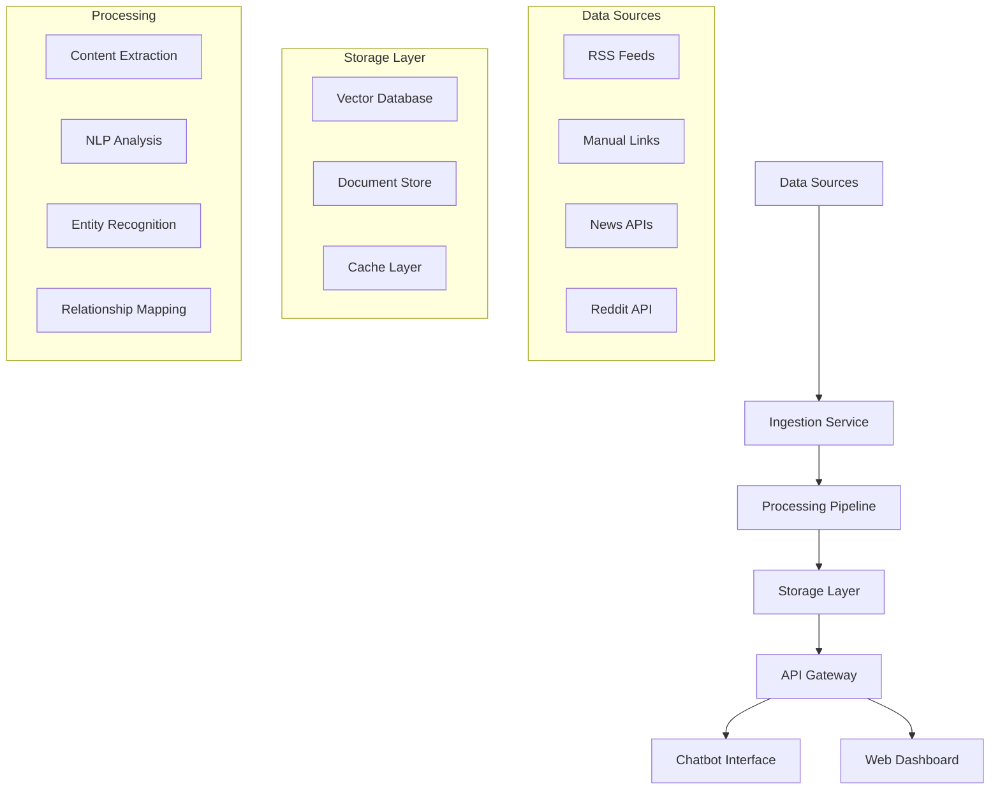
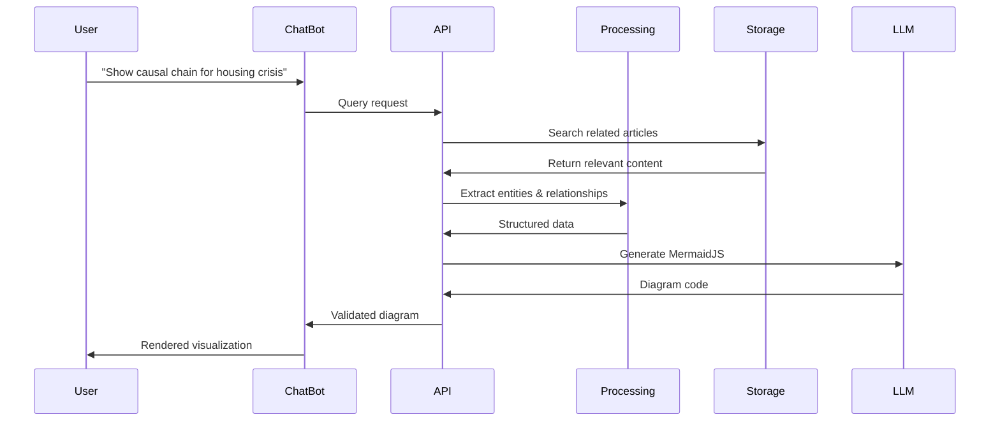

# Software Design Document (SDD)

# World Ingestion & Systems Analysis Platform

## Project: MermaidJS-Capable Systems Thinking Platform

## Author: Technical Design Team

## Date: 2025-09-26

## Version: 1.0

---

## Table of Contents

1. [System Overview](#1-system-overview)
2. [Architecture Design](#2-architecture-design)
3. [Component Specifications](#3-component-specifications)
4. [Database Design](#4-database-design)
5. [API Design](#5-api-design)
6. [User Interface Design](#6-user-interface-design)
7. [Early Prototype Implementation](#7-early-prototype-implementation)
8. [Technical Stack](#8-technical-stack)
9. [Deployment Strategy](#9-deployment-strategy)
10. [Testing Strategy](#10-testing-strategy)
11. [Development Phases](#11-development-phases)
12. [Risk Mitigation](#12-risk-mitigation)

---

## 1. System Overview

### 1.1 Purpose

The system ingests information from multiple sources (RSS feeds, manual links, APIs) and structures it for systems thinking analysis. The core capability is generating, visualizing, and troubleshooting MermaidJS diagrams through a conversational interface.

### 1.2 Core Capabilities

- **Data Ingestion**: Automated RSS feed processing, manual link submission, API integrations
- **Content Processing**: Entity extraction, relationship mapping, systems thinking analysis
- **Diagram Generation**: AI-powered MermaidJS creation with interactive refinement
- **Storage & Retrieval**: Vector-based semantic search with structured metadata
- **User Interface**: Chatbot interface with diagram troubleshooting capabilities

### 1.3 Design Principles

- **Prototype-First**: Emphasis on rapid iteration and early working versions
- **Modular Architecture**: Independent components for easy testing and deployment
- **AI-Native**: Designed around LLM capabilities and limitations
- **Scalable Foundation**: Architecture supports growth from prototype to production

---

## 2. Architecture Design

### 2.1 High-Level Architecture



### 2.2 Service Architecture

**Microservices Design for Prototype Flexibility**:

1. **Ingestion Service**: Handles all data source integrations
2. **Processing Service**: NLP, entity extraction, systems analysis
3. **Diagram Service**: MermaidJS generation and validation
4. **API Service**: Unified interface for all client interactions
5. **Chat Service**: LLM integration and conversation management

### 2.3 Data Flow



---

## 3. Component Specifications

### 3.1 Ingestion Service

**Purpose**: Automated data collection from multiple sources

**Key Components**:

- RSS Feed Processor
- Manual Link Handler
- API Integration Manager
- Content Deduplication

**Implementation Details**:

```python
class IngestionService:
    def __init__(self):
        self.rss_feeds = RSSManager()
        self.link_processor = LinkProcessor()
        self.deduplicator = ContentDeduplicator()

    async def process_feeds(self):
        """Process all configured RSS feeds"""
        for feed_url in self.rss_feeds.get_active_feeds():
            articles = await self.rss_feeds.fetch_articles(feed_url)
            for article in articles:
                if not self.deduplicator.is_duplicate(article):
                    await self.queue_for_processing(article)

    async def submit_manual_link(self, url: str, tags: List[str] = None):
        """Process manually submitted links"""
        content = await self.link_processor.extract_content(url)
        await self.queue_for_processing(content, tags=tags)
```

**Prototype Implementation Strategy**:

- Start with 5-10 RSS feeds for diverse content
- Simple web form for manual link submission
- Basic deduplication using URL and title similarity
- Queue-based processing for scalability

### 3.2 Processing Service

**Purpose**: Transform raw content into structured, analyzable data

**Key Components**:

- Content Extractor (newspaper3k/Trafilatura)
- NLP Processor (spaCy)
- Entity Recognition System
- Relationship Mapper
- Systems Thinking Analyzer

**Processing Pipeline**:

```python
class ProcessingPipeline:
    def __init__(self):
        self.extractor = ContentExtractor()
        self.nlp = spacy.load("en_core_web_sm")
        self.entity_recognizer = EntityRecognizer()
        self.relationship_mapper = RelationshipMapper()

    async def process_article(self, raw_article: Dict) -> ProcessedArticle:
        # Extract clean content
        content = self.extractor.extract(raw_article['url'])

        # NLP processing
        doc = self.nlp(content['text'])

        # Extract entities and relationships
        entities = self.entity_recognizer.extract(doc)
        relationships = self.relationship_mapper.find_relationships(doc, entities)

        # Systems thinking analysis
        systems_data = self.analyze_systems_thinking(entities, relationships)

        return ProcessedArticle(
            content=content,
            entities=entities,
            relationships=relationships,
            systems_thinking=systems_data,
            mermaid_candidates=self.generate_diagram_candidates(relationships)
        )
```

### 3.3 Diagram Service

**Purpose**: Generate and validate MermaidJS diagrams

**Key Features**:

- Multiple diagram type support (flowchart, timeline, graph)
- Syntax validation
- Interactive refinement
- Export capabilities

**Core Implementation**:

```python
class DiagramService:
    def __init__(self):
        self.validators = {
            'flowchart': FlowchartValidator(),
            'timeline': TimelineValidator(),
            'graph': GraphValidator()
        }
        self.generators = {
            'flowchart': FlowchartGenerator(),
            'timeline': TimelineGenerator(),
            'graph': GraphGenerator()
        }

    def generate_diagram(self, query: str, context_data: List[Dict]) -> MermaidDiagram:
        # Determine best diagram type for query
        diagram_type = self.classify_diagram_type(query)

        # Generate diagram structure
        generator = self.generators[diagram_type]
        diagram_code = generator.create(context_data, query)

        # Validate syntax
        validator = self.validators[diagram_type]
        if validator.is_valid(diagram_code):
            return MermaidDiagram(
                type=diagram_type,
                code=diagram_code,
                is_valid=True
            )
        else:
            # Attempt auto-correction
            corrected_code = validator.auto_correct(diagram_code)
            return MermaidDiagram(
                type=diagram_type,
                code=corrected_code,
                is_valid=validator.is_valid(corrected_code),
                corrections_applied=True
            )
```

---

## 4. Database Design

### 4.1 Data Architecture

**Hybrid Approach**: Vector Database + Relational Store

**Primary Storage**:

- **Vector Database**: Weaviate for semantic search
- **Document Store**: PostgreSQL with JSONB for structured metadata
- **Cache Layer**: Redis for frequently accessed data

### 4.2 Schema Design

**Articles Table (PostgreSQL)**:

```sql
CREATE TABLE articles (
    id UUID PRIMARY KEY DEFAULT gen_random_uuid(),
    source_type VARCHAR(50) NOT NULL, -- 'rss', 'manual', 'api'
    source_url TEXT NOT NULL,
    title TEXT NOT NULL,
    content TEXT NOT NULL,
    published_date TIMESTAMP,
    ingestion_date TIMESTAMP DEFAULT NOW(),
    domain VARCHAR(100), -- 'politics', 'economics', etc.
    tags JSONB DEFAULT '[]',
    processing_status VARCHAR(20) DEFAULT 'pending',

    -- Systems thinking metadata
    entities JSONB DEFAULT '[]',
    relationships JSONB DEFAULT '[]',
    leverage_points JSONB DEFAULT '[]',
    feedback_loops JSONB DEFAULT '[]',

    -- Diagram generation metadata
    mermaid_candidates JSONB DEFAULT '{}',

    CONSTRAINT unique_source_url UNIQUE(source_url)
);

-- Indexes for efficient querying
CREATE INDEX idx_articles_domain ON articles(domain);
CREATE INDEX idx_articles_published ON articles(published_date);
CREATE INDEX idx_articles_ingestion ON articles(ingestion_date);
CREATE GIN INDEX idx_articles_entities ON articles USING GIN(entities);
CREATE GIN INDEX idx_articles_relationships ON articles USING GIN(relationships);
```

**Entities Table**:

```sql
CREATE TABLE entities (
    id UUID PRIMARY KEY DEFAULT gen_random_uuid(),
    name VARCHAR(255) NOT NULL,
    type VARCHAR(50) NOT NULL, -- 'PERSON', 'ORG', 'CONCEPT', 'EVENT'
    aliases JSONB DEFAULT '[]',
    importance_score FLOAT DEFAULT 0.0,
    first_mentioned TIMESTAMP DEFAULT NOW(),
    mention_count INTEGER DEFAULT 1,
    domains JSONB DEFAULT '[]',

    CONSTRAINT unique_entity_name_type UNIQUE(name, type)
);
```

**Relationships Table**:

```sql
CREATE TABLE relationships (
    id UUID PRIMARY KEY DEFAULT gen_random_uuid(),
    from_entity_id UUID REFERENCES entities(id),
    to_entity_id UUID REFERENCES entities(id),
    relationship_type VARCHAR(50) NOT NULL, -- 'CAUSES', 'INFLUENCES', etc.
    confidence_score FLOAT DEFAULT 0.0,
    temporal_context VARCHAR(100), -- 'before', 'during', 'after'
    source_articles JSONB DEFAULT '[]',
    evidence_count INTEGER DEFAULT 1,

    CONSTRAINT unique_relationship UNIQUE(from_entity_id, to_entity_id, relationship_type)
);
```

### 4.3 Vector Database Schema (Weaviate)

```python
# Weaviate schema configuration
article_schema = {
    "class": "Article",
    "description": "Processed articles with embedded content",
    "properties": [
        {
            "name": "title",
            "dataType": ["text"],
            "description": "Article title"
        },
        {
            "name": "content",
            "dataType": ["text"],
            "description": "Article content for semantic search"
        },
        {
            "name": "domain",
            "dataType": ["string"],
            "description": "Subject domain"
        },
        {
            "name": "published_date",
            "dataType": ["date"],
            "description": "Publication date"
        },
        {
            "name": "entities",
            "dataType": ["string[]"],
            "description": "Extracted entities"
        },
        {
            "name": "postgres_id",
            "dataType": ["string"],
            "description": "Reference to PostgreSQL record"
        }
    ],
    "vectorizer": "text2vec-transformers"
}
```

---

## 5. API Design

### 5.1 RESTful API Endpoints

**Base URL**: `https://api.systems-platform.com/v1`

**Core Endpoints**:

```yaml
# Content Ingestion
POST /ingest/rss
POST /ingest/manual
GET /ingest/status/{job_id}

# Search & Retrieval
GET /search/articles?q={query}&domain={domain}&limit={limit}
GET /search/entities?name={name}&type={type}
GET /search/relationships?entity={entity_id}

# Diagram Generation
POST /diagrams/generate
POST /diagrams/refine/{diagram_id}
GET /diagrams/{diagram_id}
GET /diagrams/{diagram_id}/export?format={png|svg|json}

# Systems Analysis
GET /analysis/leverage-points?topic={topic}
GET /analysis/feedback-loops?domain={domain}
GET /analysis/trends?timeframe={timeframe}
```

### 5.2 API Specifications

**Diagram Generation Endpoint**:

```python
@app.post("/diagrams/generate")
async def generate_diagram(request: DiagramRequest):
    """
    Generate MermaidJS diagram based on query and context
    """

    # Request model
    class DiagramRequest(BaseModel):
        query: str
        diagram_type: Optional[str] = None  # auto-detect if None
        context_filter: Optional[Dict] = None
        complexity_level: str = "medium"  # simple, medium, detailed

    # Response model
    class DiagramResponse(BaseModel):
        diagram_id: str
        diagram_type: str
        mermaid_code: str
        is_valid: bool
        validation_errors: List[str] = []
        suggestions: List[str] = []
        render_url: str

    # Implementation
    try:
        # Search for relevant content
        search_results = await search_service.semantic_search(
            query=request.query,
            filters=request.context_filter,
            limit=20
        )

        # Generate diagram
        diagram = await diagram_service.generate_diagram(
            query=request.query,
            context_data=search_results,
            complexity=request.complexity_level
        )

        # Store and return
        diagram_id = await storage.save_diagram(diagram)

        return DiagramResponse(
            diagram_id=diagram_id,
            diagram_type=diagram.type,
            mermaid_code=diagram.code,
            is_valid=diagram.is_valid,
            validation_errors=diagram.validation_errors,
            suggestions=diagram.suggestions,
            render_url=f"/diagrams/{diagram_id}/render"
        )

    except Exception as e:
        raise HTTPException(status_code=500, detail=str(e))
```

### 5.3 WebSocket API for Real-time Chat

```python
@app.websocket("/chat")
async def chat_endpoint(websocket: WebSocket):
    await websocket.accept()
    session_id = str(uuid.uuid4())

    try:
        while True:
            # Receive message
            data = await websocket.receive_json()
            message = data.get("message")

            # Process with LLM
            response = await chat_service.process_message(
                message=message,
                session_id=session_id
            )

            # Send response
            await websocket.send_json({
                "type": "message",
                "content": response.text,
                "diagram": response.diagram if response.has_diagram else None,
                "timestamp": datetime.utcnow().isoformat()
            })

    except WebSocketDisconnect:
        await chat_service.cleanup_session(session_id)
```

---

## 6. User Interface Design

### 6.1 Chatbot Interface

**Primary Interface**: Conversational diagram generation

**Key Features**:

- Real-time MermaidJS rendering
- Interactive diagram refinement
- Export capabilities
- Conversation history
- Diagram versioning

**Component Architecture**:

```javascript
// React component structure
<ChatInterface>
  <ConversationHistory />
  <MessageInput />
  <DiagramRenderer>
    <MermaidVisualization />
    <DiagramControls>
      <ExportButton />
      <RefineButton />
      <ShareButton />
    </DiagramControls>
  </DiagramRenderer>
  <SuggestionsPanel />
</ChatInterface>
```

**Sample User Flow**:

1. User enters query: "Show me the housing crisis causal chain"
2. System searches relevant articles
3. AI generates MermaidJS flowchart
4. Diagram renders with live preview
5. User can refine: "Make it simpler" or "Add government policies"
6. System iterates on diagram
7. User exports final version

### 6.2 Web Dashboard (Phase 2)

**Purpose**: Topic tracking and analysis management

**Key Sections**:

- Saved Diagrams Library
- Topic Tracking Dashboard
- Data Source Management
- Export & Sharing Tools

---

## 7. Early Prototype Implementation

### 7.1 MVP Prototype Architecture

**Simplified Stack for Rapid Development**:

- **Backend**: FastAPI (Python)
- **Frontend**: Gradio for initial chatbot interface
- **Database**: SQLite + ChromaDB for vector search
- **LLM**: OpenAI GPT-4 API
- **Deployment**: Single container on Railway/Render

### 7.2 Prototype Components

**1. Minimal Ingestion Service**:

```python
# Simple RSS processor for prototype
class PrototypeIngestion:
    def __init__(self):
        self.feeds = [
            "https://feeds.reuters.com/reuters/topNews",
            "https://rss.cnn.com/rss/edition.rss",
            "https://feeds.bbci.co.uk/news/rss.xml"
        ]

    async def fetch_daily_articles(self):
        """Fetch articles from RSS feeds once daily"""
        all_articles = []
        for feed_url in self.feeds:
            articles = feedparser.parse(feed_url)
            for entry in articles.entries[:5]:  # Limit for prototype
                article = {
                    'title': entry.title,
                    'content': entry.summary,
                    'url': entry.link,
                    'published': entry.published
                }
                all_articles.append(article)
        return all_articles
```

**2. Simple Processing Pipeline**:

```python
class PrototypeProcessor:
    def __init__(self):
        self.nlp = spacy.load("en_core_web_sm")

    def extract_entities(self, text: str) -> List[Dict]:
        """Basic entity extraction for prototype"""
        doc = self.nlp(text)
        entities = []
        for ent in doc.ents:
            if ent.label_ in ["PERSON", "ORG", "GPE"]:
                entities.append({
                    'text': ent.text,
                    'label': ent.label_,
                    'start': ent.start_char,
                    'end': ent.end_char
                })
        return entities

    def find_causal_relationships(self, text: str) -> List[Dict]:
        """Simple pattern matching for causal language"""
        causal_patterns = [
            r"(\w+(?:\s+\w+)*)\s+(?:causes?|leads? to|results? in)\s+(\w+(?:\s+\w+)*)",
            r"(?:because of|due to)\s+(\w+(?:\s+\w+)*)[,\s]+(\w+(?:\s+\w+)*)",
        ]

        relationships = []
        for pattern in causal_patterns:
            matches = re.finditer(pattern, text, re.IGNORECASE)
            for match in matches:
                relationships.append({
                    'from': match.group(1).strip(),
                    'to': match.group(2).strip(),
                    'type': 'CAUSES',
                    'confidence': 0.6  # Basic confidence score
                })
        return relationships
```

**3. Basic Diagram Generator**:

```python
class PrototypeDiagramGenerator:
    def generate_flowchart(self, entities: List[Dict], relationships: List[Dict]) -> str:
        """Generate simple MermaidJS flowchart"""

        # Create nodes
        nodes = {}
        for i, entity in enumerate(entities[:8]):  # Limit for readability
            node_id = f"A{i}"
            nodes[entity['text']] = node_id

        # Start diagram
        diagram = "graph TD\n"

        # Add node definitions
        for text, node_id in nodes.items():
            clean_text = text.replace('"', "'")
            diagram += f'    {node_id}["{clean_text}"]\n'

        # Add relationships
        for rel in relationships:
            from_node = nodes.get(rel['from'])
            to_node = nodes.get(rel['to'])
            if from_node and to_node:
                diagram += f"    {from_node} --> {to_node}\n"

        return diagram

    def validate_mermaid(self, code: str) -> bool:
        """Basic validation for MermaidJS syntax"""
        try:
            # Check for basic structure
            if not code.strip().startswith(("graph", "flowchart", "timeline")):
                return False

            # Check for balanced brackets
            if code.count('[') != code.count(']'):
                return False
            if code.count('(') != code.count(')'):
                return False

            return True
        except:
            return False
```

### 7.3 Prototype Deployment

**Single Container Deployment**:

```dockerfile
FROM python:3.11-slim

WORKDIR /app

# Install dependencies
COPY requirements.txt .
RUN pip install -r requirements.txt

# Download spaCy model
RUN python -m spacy download en_core_web_sm

# Copy application
COPY . .

# Expose port
EXPOSE 8000

# Run application
CMD ["uvicorn", "main:app", "--host", "0.0.0.0", "--port", "8000"]
```

**Environment Setup**:

```bash
# requirements.txt
fastapi==0.104.1
uvicorn==0.24.0
gradio==4.7.1
feedparser==6.0.10
spacy==3.7.2
chromadb==0.4.15
openai==1.3.5
sqlalchemy==2.0.23
python-multipart==0.0.6

# Environment variables
OPENAI_API_KEY=your_key_here
DATABASE_URL=sqlite:///./prototype.db
```

---

## 8. Technical Stack

### 8.1 MVP Stack

**Backend**:

- **Language**: Python 3.11+
- **Framework**: FastAPI
- **Database**: SQLite + ChromaDB
- **NLP**: spaCy, sentence-transformers
- **LLM**: OpenAI GPT-4 API

**Frontend**:

- **Prototype**: Gradio
- **Production**: React + TypeScript
- **Visualization**: mermaid.js

**Infrastructure**:

- **Deployment**: Railway/Render
- **Monitoring**: Basic logging
- **Version Control**: Git + GitHub

### 8.2 Production Stack (Phase 2+)

**Backend**:

- **Framework**: FastAPI (continue)
- **Database**: PostgreSQL + Weaviate
- **Cache**: Redis
- **Queue**: Celery + Redis
- **Monitoring**: Sentry + Prometheus

**Frontend**:

- **Framework**: React + TypeScript
- **State Management**: Zustand
- **Build Tool**: Vite
- **Testing**: Jest + React Testing Library

**Infrastructure**:

- **Deployment**: Kubernetes on DigitalOcean
- **CI/CD**: GitHub Actions
- **Monitoring**: Grafana + Prometheus
- **Security**: Let's Encrypt SSL

---

## 9. Deployment Strategy

### 9.1 Prototype Deployment

**Single Container Approach**:

1. Build Docker image with all dependencies
2. Deploy to Railway/Render for simplicity
3. Use SQLite for data persistence
4. Environment-based configuration

**Deployment Commands**:

```bash
# Build and deploy
docker build -t systems-platform .
docker push your-registry/systems-platform

# Or direct deployment to Railway
railway login
railway deploy
```

### 9.2 Production Deployment

**Microservices on Kubernetes**:

```yaml
# kubernetes/ingestion-service.yaml
apiVersion: apps/v1
kind: Deployment
metadata:
  name: ingestion-service
spec:
  replicas: 2
  selector:
    matchLabels:
      app: ingestion-service
  template:
    metadata:
      labels:
        app: ingestion-service
    spec:
      containers:
        - name: ingestion
          image: your-registry/ingestion-service:latest
          ports:
            - containerPort: 8000
          env:
            - name: DATABASE_URL
              valueFrom:
                secretKeyRef:
                  name: db-secret
                  key: url
---
apiVersion: v1
kind: Service
metadata:
  name: ingestion-service
spec:
  selector:
    app: ingestion-service
  ports:
    - port: 80
      targetPort: 8000
```

### 9.3 Database Migration Strategy

**From Prototype to Production**:

1. Export SQLite data to JSON
2. Set up PostgreSQL + Weaviate
3. Migrate data with transformation scripts
4. Switch DNS to new infrastructure

---

## 10. Testing Strategy

### 10.1 Unit Testing

**Core Components**:

```python
# test_diagram_generator.py
def test_flowchart_generation():
    generator = DiagramGenerator()
    entities = [
        {'text': 'Government Policy', 'type': 'CONCEPT'},
        {'text': 'Housing Prices', 'type': 'CONCEPT'}
    ]
    relationships = [
        {'from': 'Government Policy', 'to': 'Housing Prices', 'type': 'INFLUENCES'}
    ]

    diagram = generator.generate_flowchart(entities, relationships)

    assert 'graph TD' in diagram
    assert 'Government Policy' in diagram
    assert 'Housing Prices' in diagram
    assert '-->' in diagram

def test_mermaid_validation():
    generator = DiagramGenerator()

    valid_diagram = "graph TD\n    A[Start] --> B[End]"
    assert generator.validate_mermaid(valid_diagram) == True

    invalid_diagram = "graph TD\n    A[Start --> B[End"
    assert generator.validate_mermaid(invalid_diagram) == False
```

### 10.2 Integration Testing

**API Testing**:

```python
# test_api.py
import pytest
from fastapi.testclient import TestClient
from main import app

client = TestClient(app)

def test_generate_diagram_endpoint():
    request_data = {
        "query": "show housing crisis causes",
        "complexity_level": "simple"
    }

    response = client.post("/diagrams/generate", json=request_data)

    assert response.status_code == 200
    data = response.json()
    assert "diagram_id" in data
    assert "mermaid_code" in data
    assert data["is_valid"] == True
```

### 10.3 End-to-End Testing

**User Workflow Testing**:

```python
# test_e2e.py
def test_complete_workflow():
    # 1. Ingest article
    article_url = "https://example.com/test-article"
    ingest_response = client.post("/ingest/manual", json={"url": article_url})
    assert ingest_response.status_code == 200

    # 2. Wait for processing
    time.sleep(5)

    # 3. Search for content
    search_response = client.get(f"/search/articles?q=housing")
    assert search_response.status_code == 200
    assert len(search_response.json()["results"]) > 0

    # 4. Generate diagram
    diagram_response = client.post("/diagrams/generate", json={
        "query": "housing crisis causes"
    })
    assert diagram_response.status_code == 200

    # 5. Validate diagram renders
    diagram_id = diagram_response.json()["diagram_id"]
    render_response = client.get(f"/diagrams/{diagram_id}/render")
    assert render_response.status_code == 200
```

---

## 11. Development Phases

### 11.1 Phase 1: MVP Prototype (4-6 weeks)

**Week 1-2: Core Infrastructure**

- [ ] Set up FastAPI backend with basic endpoints
- [ ] Implement SQLite + ChromaDB storage
- [ ] Create simple RSS feed ingestion
- [ ] Basic entity extraction with spaCy

**Week 3-4: Diagram Generation**

- [ ] Implement MermaidJS generator for flowcharts
- [ ] Add syntax validation and error handling
- [ ] Create basic LLM integration for diagram refinement
- [ ] Build Gradio chat interface

**Week 5-6: Integration & Testing**

- [ ] End-to-end workflow testing
- [ ] Performance optimization
- [ ] Basic error handling and logging
- [ ] Deployment to staging environment

**Success Criteria**:

- Generate valid MermaidJS diagrams for 80% of queries
- Process 50+ articles successfully
- Sub-5 second response time for diagram generation
- Successful deployment with 99% uptime

### 11.2 Phase 2: Enhanced Features (6-8 weeks)

**Features to Add**:

- Web UI dashboard for saved diagrams
- Multiple diagram types (timeline, graph, sequence)
- Advanced entity recognition and relationship mapping
- User authentication and session management
- Export capabilities (PNG, SVG, PDF)

**Technical Improvements**:

- Migration to PostgreSQL + Weaviate
- Improved LLM prompt engineering
- Better caching and performance optimization
- Comprehensive monitoring and logging

### 11.3 Phase 3: Scale & Advanced Features (8-12 weeks)

**Advanced Capabilities**:

- Real-time collaboration on diagrams
- Advanced systems thinking analysis
- Integration with external tools (Notion, Obsidian)
- Mobile-responsive design
- API rate limiting and usage analytics

**Infrastructure Scaling**:

- Kubernetes deployment
- Microservices architecture
- Advanced caching strategies
- Load balancing and auto-scaling

---

## 12. Risk Mitigation

### 12.1 Technical Risks

**Risk**: MermaidJS generation quality

- **Mitigation**: Comprehensive prompt engineering, syntax validation, user feedback loops
- **Fallback**: Manual diagram editing tools, template-based generation

**Risk**: LLM API costs and rate limits

- **Mitigation**: Response caching, request batching, multiple provider support
- **Fallback**: Local LLM deployment (Ollama), reduced functionality mode

**Risk**: Vector database performance at scale

- **Mitigation**: Proper indexing, query optimization, database monitoring
- **Fallback**: Elasticsearch migration path, horizontal scaling

### 12.2 Product Risks

**Risk**: User adoption and engagement

- **Mitigation**: Early user feedback, iterative improvement, clear value demonstration
- **Fallback**: Pivot to specific use cases (research, education, consulting)

**Risk**: Content quality and accuracy

- **Mitigation**: Source diversity, confidence scoring, user verification features
- **Fallback**: Manual curation tools, community moderation

### 12.3 Operational Risks

**Risk**: Data source reliability

- **Mitigation**: Multiple redundant sources, graceful degradation, offline mode
- **Fallback**: Manual content upload, cached content serving

**Risk**: Deployment complexity

- **Mitigation**: Progressive deployment, comprehensive testing, rollback procedures
- **Fallback**: Simplified single-container deployment, managed services

---

## Conclusion

This SDD provides a comprehensive technical foundation for building the World Ingestion & Systems Analysis Platform with emphasis on early working prototypes. The modular architecture supports rapid iteration while maintaining scalability for future growth.

**Key Success Factors**:

1. **Prototype-First Approach**: Working software over comprehensive documentation
2. **Modular Design**: Independent components for easier testing and deployment
3. **AI-Native Architecture**: Designed around LLM capabilities and limitations
4. **User-Centric Features**: Focus on diagram generation and troubleshooting workflows

**Next Steps**:

1. Set up development environment and basic project structure
2. Implement MVP prototype following Phase 1 timeline
3. Deploy to staging environment for early user testing
4. Gather feedback and iterate based on actual usage patterns

The emphasis on early working prototypes ensures that each phase delivers value while building toward the comprehensive vision outlined in the PRD.
